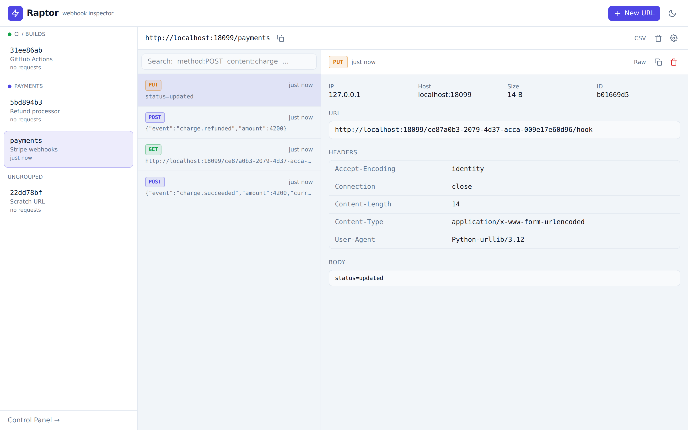
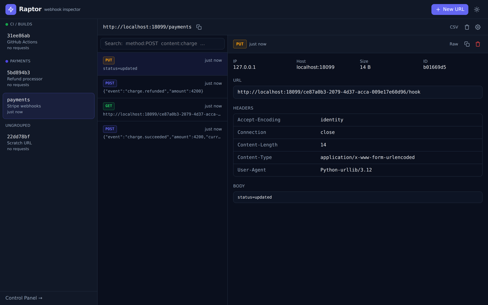
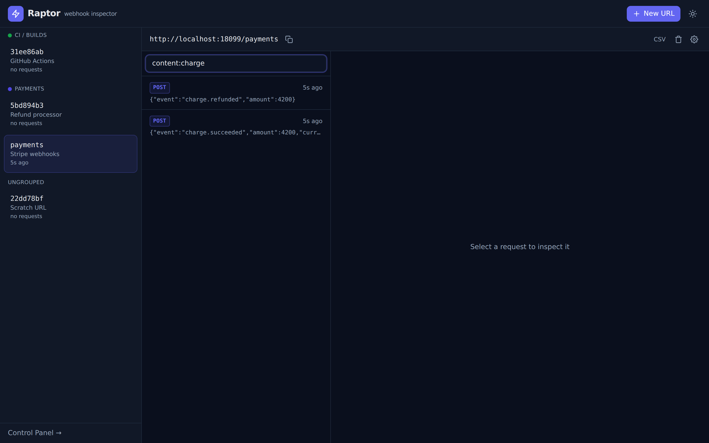
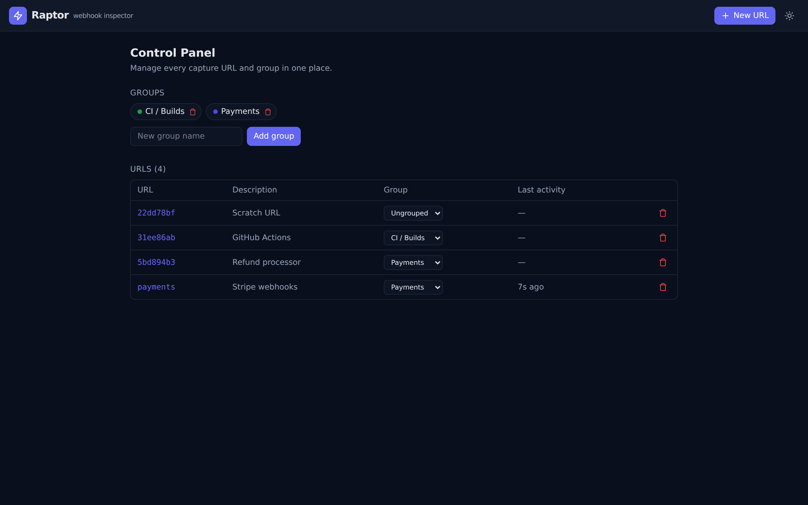
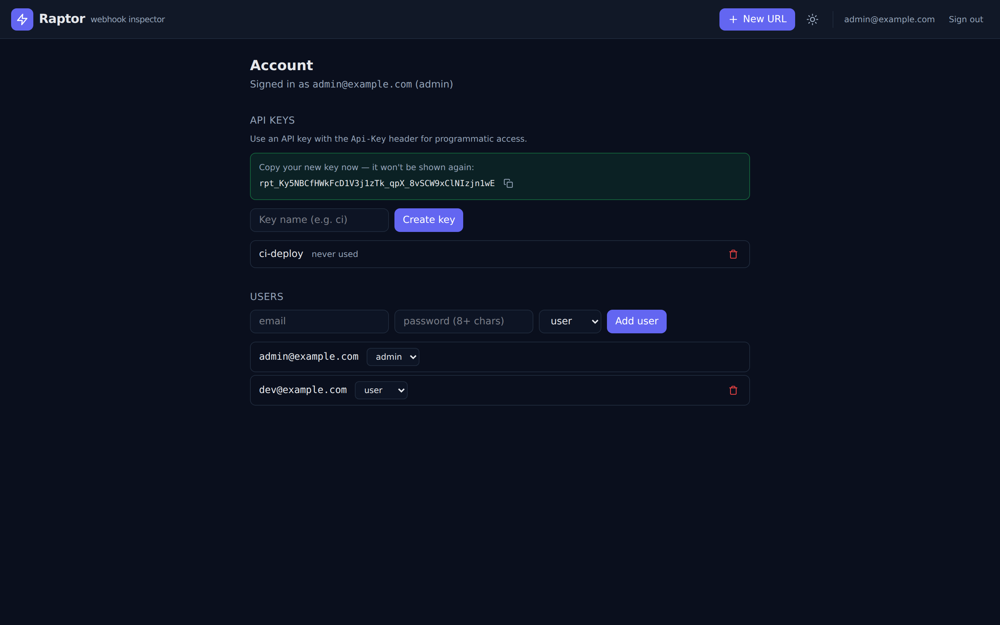
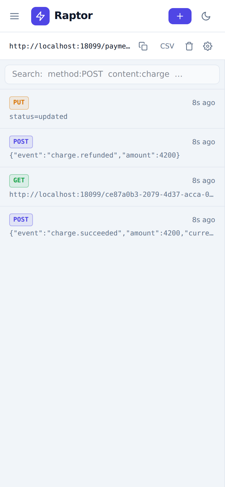
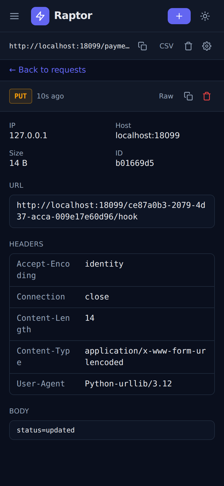

# Raptor

**Self-hosted webhook, email & DNS capture and inspection.** Spin up instant,
unique URLs, email addresses and DNS hostnames that capture, inspect, transform,
automate and forward inbound HTTP requests, emails and DNS queries — all from a
single static binary with an embedded UI.

## Screenshots

### Inbox — light & dark

| Light | Dark |
| --- | --- |
|  |  |

### Search & Control Panel

| Search DSL | Control Panel |
| --- | --- |
|  |  |

### Email & DNS capture

| Email (rendered + auth checks) | DNS query |
| --- | --- |
|  |  |

### Custom Actions & Schedules

| Custom Actions | Schedules |
| --- | --- |
|  |  |

### Accounts & access control

Anonymous-by-default: a first visit gives you your own URL with no login; sign in
or register to keep your URLs across browsers.

| Anonymous first visit | Sign in / register | Account & users |
| --- | --- | --- |
|  |  |  |

### Mobile (responsive)

| Light | Dark |
| --- | --- |
|  |  |

## Features

### Capture & inspect

- **Instant capture URLs** — every method on any sub-path is recorded:
  `POST /{token}/any/path`, alias URLs, and a `/{token}/{statusCode}` form to
  force a response status for retry testing.
- **Full request inspection** — method, headers, query, body, client IP, host
  and user-agent, all captured and rendered.
- **Real-time inbox** — new requests stream into the UI instantly over
  Server-Sent Events, with a 60-second polled fallback.
- **Configurable default response** — status, body, content-type, permissive
  CORS, and redirect, all editable per URL.
- **Guardrails** — per-URL `100 ÷ timeout` rpm rate limit, `request_limit`
  ring-buffer, body-size cap and TTL `expiry`.

### Organise & manage

- **Search DSL** — filter the inbox with a Lucene-style query: free text matches
  the body, plus `method:POST`, `type:web`, `content:charge`, `ip:`, `host:`,
  `url:`, `query:`, `headers.x-event:push`, `_exists_:custom_action_errors`, and
  date ranges like `created_at:[* TO now-14d]`. Terms are ANDed.
- **Subset delete** — delete only the requests matching a search query or
  `date_from`/`date_to` window, or clear everything.
- **Groups** — organise URLs into colour-coded groups; the sidebar buckets them
  and a group can be deleted without losing its URLs.
- **Control Panel** — manage every URL and group from one table: reassign groups,
  open or delete URLs, and create/delete groups.

### Inbound email capture

- An SMTP server captures mail sent to `{token}@{email-domain}`. Messages are
  MIME-parsed (subject, sender, HTML and plain bodies, **attachments**), and
  **DKIM/SPF/DMARC** are evaluated and shown as badges. HTML bodies render in a
  fully sandboxed iframe (no script execution).

### Inbound DNS capture

- A DNS server (UDP+TCP) captures queries for `{token}.{dns-domain}` and any
  subdomain, recording the query name, type and client IP, and returns a minimal
  answer.

Email and DNS captures share the inbox, search, SSE stream and CSV export with
HTTP requests — filter them with `type:email` / `type:dns`.

#### Exposing email & DNS

The SMTP (`2525`) and DNS (`5354`) listeners default to unprivileged ports. To
accept real mail/queries on the standard ports, put a reverse proxy or port
forward in front (`25 → 2525`, `53 → 5354`), and point DNS at your host:

- **Email:** add an MX record for `emailhook.site` → your host.
- **DNS:** delegate `dnshook.site` with an NS record pointing at your host, so
  all `*.dnshook.site` queries reach Raptor.

Override the suffixes with `--email-domain` / `--dns-domain` to use your own.

### Custom Actions

Enable **Actions** on a URL to run an ordered chain on every captured request.
Actions share variables (`$name$`, plus `$request.content$`, `$request.method$`,
`$request.query.x$`, `$request.header.x$`), can gate or stop the chain, extract
data, call out over HTTP, and build the response.

| Type | Purpose |
| --- | --- |
| `set_variable` | Assign an (interpolated) value to a variable |
| `modify_response` | Override response status / body / content-type / headers |
| `conditions` | Gate the chain (`stop`/`skip`) on `input <op> value` |
| `extract_json` | Pull a value out of JSON via a [gjson](https://github.com/tidwall/gjson) path |
| `extract_regex` | Capture a regex group into a variable |
| `http_request` | Call another URL (JSON or `forward` mode); response → `$response.body$` |
| `script` | Run JavaScript ([goja](https://github.com/dop251/goja)) with `respond()`, `get`/`set`, `stop()`, `dont_save()`, `echo()`, `JSON` |
| `dont_save` | Record actions but don't persist the request |
| `stop` | Halt the chain |

Each request stores a per-action **run log** (visible in the detail pane and
replayable). Test a single action against your latest request from the editor
before saving.

### Schedules & monitoring

- Run a target URL (or a token's action chain) on a 5-field cron interval, with
  monitoring/alerting:
  - **status** (expected code or any non-2xx), **keyword** (body must contain a
    string), **uptime** (host reachable), and **SSL** (cert expiring within N days).
  - alerts are delivered via a **Shoutrrr** notify URL (Slack/Discord/Telegram/
    ntfy/Gotify/SMTP/…); each run is recorded with history, and schedules can be
    run on demand.

### Replay & CLI forwarding

- **Replay** — re-deliver a subset of captured requests (selected by the search
  DSL) to a target URL, preserving method, body and headers (credentials stripped).
- **CLI forwarding (`listen`)** — set a token's `listen` window and a capture is
  held open until a CLI client supplies the response via the set-response
  endpoint (`POST /requests/{id}/response`) — letting a local process handle the
  request and return a dynamic response.

### Accounts & access control

- **Anonymous by default** — like webhook.site, every visitor automatically gets
  their own identity (a cookie) and their own URLs, with no login required. On a
  first visit a URL is auto-created. Visitors only see and manage their own URLs;
  the capture endpoints stay public so anyone can deliver to a URL.
- **Optional login & registration** — visitors can register an account (their
  anonymous URLs migrate to it) and sign in from any browser. Registration is
  toggleable with `--allow-registration` / `RAPTOR_ALLOW_REGISTRATION`: turn it
  off to lock signups while still allowing existing users to log in. The first
  account is always allowed and becomes **admin**; an admin can also be seeded
  from the environment (`RAPTOR_ADMIN_EMAIL` / `RAPTOR_ADMIN_PASSWORD`) or reset
  from the CLI (`--reset-password`).
- **Private mode** — set `--require-auth` to drop anonymous access entirely and
  require login for the whole management API.
- **Multi-user & roles** — admins manage users (admin/user roles) from the
  Account screen and see all URLs. Passwords are bcrypt-hashed.
- **Sessions & API keys** — the UI authenticates with a secure session cookie
  (id hashed at rest); API clients use `Api-Key: <key>` (keys are shown once and
  stored only as a SHA-256 hash). Basic Auth is also accepted.

### Platform

- **Modern UI** — React + TypeScript SPA embedded in the binary, system-aware
  light/dark theme with a persisted toggle, responsive from phone to desktop.
- **REST API first** — every UI action maps to a documented `/api/v1` endpoint;
  interactive Swagger UI at `/api/docs`.
- **Operations** — CSV export of captured requests, Prometheus metrics at
  `/metrics`, JSON health at `/health`.
- **Pick your database** — run on **SQLite** (default, zero-config), **PostgreSQL**
  or **MySQL** with the same schema; select it with `RAPTOR_DB_DRIVER` and point
  it at your server via environment variables. See [Database](#database).
- **Single binary** — pure-Go, `CGO_ENABLED=0`, all three database drivers
  CGO-free, the React UI embedded via `embed.FS`.

## Security

- **Secrets at rest** — notify URLs and other credentials are encrypted with
  **AES-256-GCM**; the key is generated on first run and stored as `secret.key`
  in the data directory (mode `0600`).
- **SSRF protection** — every server-side outbound request (Custom Actions
  `http_request`/`script`, replay, schedule monitoring) goes through one guard.
  Internal targets (loopback, link-local incl. cloud metadata `169.254.169.254`,
  private and CGNAT ranges) are **blocked by default**, enforced against the
  *resolved* IP and re-checked across redirects. Scope hosts with
  `--action-allow` / `--action-deny`, or permit internal targets with
  `--action-allow-internal`.
- **No credential leakage** — replay and `forward` mode strip `Authorization` /
  `Cookie` / `Proxy-Authorization` headers; captured email HTML renders in a
  sandboxed iframe; CSV export neutralises spreadsheet formula injection.

## Quick start

### Docker Compose

```bash
docker compose up --build
# UI + API + capture: http://localhost:8084  (email :2525, DNS :5354/udp)
```

The compose file documents the optional environment variables (accounts,
email/DNS suffixes, action SSRF policy) as comments — uncomment what you need.

### Docker

Use a **named volume** for `/data` (not a host bind mount: the image runs as a
non-root user, and a root-owned bind-mounted directory isn't writable). `/data`
holds the generated AES key (`secret.key`) and uploaded files — and, with the
default SQLite driver, the database file too — so keep it. When using an external
**Postgres/MySQL** database, `/data` still holds the key and uploads (persist it),
while captured data lives in your database.

```bash
docker volume create raptor-data
docker run -p 8084:8084 -p 2525:2525 -p 5354:5354/udp \
  -v raptor-data:/data \
  -e RAPTOR_BASE_URL=http://localhost:8084 \
  techblog/raptor:latest
```

Images are published multi-arch (`linux/amd64,arm64,arm/v7`) to
`techblog/raptor`. See [CLI flags](#cli-flags) for the full set of `--flag` /
`RAPTOR_*` options (auth, registration toggle, admin seeding, SSRF policy, …).

### From source

```bash
cd web && npm ci && npm run build && cd ..   # build & embed the UI
go build -o raptor ./cmd/raptor
./raptor --base-url http://localhost:8084 --data ./data
```

Then open <http://localhost:8084> — by default you immediately get **your own
URL** (no login needed). Send a request to it:

```bash
curl -X POST http://localhost:8084/<token>/demo \
  -H 'Content-Type: application/json' -d '{"hello":"world"}'
```

It appears in the inbox instantly.

### Running privately (accounts)

By default Raptor is anonymous-by-default with open registration. For a private,
account-gated instance, seed an admin and require login:

```bash
docker run -p 8084:8084 -v raptor-data:/data \
  -e RAPTOR_BASE_URL=https://hooks.example.com \
  -e RAPTOR_REQUIRE_AUTH=true \
  -e RAPTOR_ALLOW_REGISTRATION=false \
  -e RAPTOR_ADMIN_EMAIL=admin@example.com \
  -e RAPTOR_ADMIN_PASSWORD=change-me-please \
  techblog/raptor:latest
```

## CLI flags

| Flag | Env | Default | Purpose |
| --- | --- | --- | --- |
| `--port` | `RAPTOR_PORT` | `8084` | HTTP port (app + capture + API) |
| `--smtp-port` | `RAPTOR_SMTP_PORT` | `2525` | Inbound email listener |
| `--dns-port` | `RAPTOR_DNS_PORT` | `5354` | Inbound DNS listener |
| `--data` | `RAPTOR_DATA` | `/data` | SQLite file + uploaded files directory |
| `--db-driver` | `RAPTOR_DB_DRIVER` | `sqlite` | `sqlite` \| `postgres` \| `mysql` |
| `--db-host` | `RAPTOR_DB_HOST` | — | Database host (postgres/mysql) |
| `--db-port` | `RAPTOR_DB_PORT` | `0` | Database port (`0` = driver default: 5432/3306) |
| `--db-name` | `RAPTOR_DB_NAME` | `raptor` | Database name (postgres/mysql) |
| `--db-user` | `RAPTOR_DB_USER` | — | Database user (postgres/mysql) |
| — | `RAPTOR_DB_PASSWORD` | — | Database password — **env only** (a secret) |
| `--db-sslmode` | `RAPTOR_DB_SSLMODE` | `disable` | Postgres TLS mode: `disable`\|`require`\|`verify-ca`\|`verify-full` |
| — | `RAPTOR_DB_DSN` | — | Full driver DSN override — **env only**; supersedes the fields above |
| `--base-url` | `RAPTOR_BASE_URL` | `http://localhost:8084` | External base URL for copyable links |
| `--email-domain` | `RAPTOR_EMAIL_DOMAIN` | `emailhook.site` | Inbound email suffix |
| `--dns-domain` | `RAPTOR_DNS_DOMAIN` | `dnshook.site` | Inbound DNS suffix |
| `--max-requests` | `RAPTOR_MAX_REQUESTS` | `0` | Per-URL stored-request cap (`0` = unlimited) |
| `--geoip-db` | `RAPTOR_GEOIP_DB` | — | Optional MaxMind GeoLite2 DB for request geo |
| `--log-level` | `RAPTOR_LOG_LEVEL` | `info` | `debug` \| `info` \| `warning` \| `error` |
| `--require-auth` | `RAPTOR_REQUIRE_AUTH` | `false` | Require login for the management API (no anonymous access) |
| `--allow-registration` | `RAPTOR_ALLOW_REGISTRATION` | `true` | Allow new users to self-register |
| `--reset-password` | — | — | Interactively set an admin password and exit |
| — | `RAPTOR_ADMIN_EMAIL` | — | Seed an initial admin email on first run |
| — | `RAPTOR_ADMIN_PASSWORD` | — | Seed the initial admin password on first run |
| `--action-allow` | `RAPTOR_ACTION_ALLOW` | — | Comma-separated allow-list of hosts for outbound requests |
| `--action-deny` | `RAPTOR_ACTION_DENY` | — | Comma-separated deny-list of hosts for outbound requests |
| `--action-allow-internal` | `RAPTOR_ACTION_ALLOW_INTERNAL` | `false` | Permit outbound requests to reach internal/loopback hosts |
| `--version` | — | — | Print version and exit |

**Precedence:** environment variable → `--flag` → built-in default (an env var,
when set, overrides the flag).

## Database

Raptor runs on **SQLite** (default), **PostgreSQL** or **MySQL** — selected with
`RAPTOR_DB_DRIVER`. All three use the same schema and are exercised by the same
migrations; pick whichever your deployment already operates. The driver is
pure-Go in every case, so the binary stays `CGO_ENABLED=0`.

- **SQLite** (default) — zero-config; the database file lives in `--data`
  (`/data/raptor.db`) alongside the encryption key. Ideal for single-node use.
- **PostgreSQL** — set the host/credentials and Raptor builds the DSN for you:

  ```bash
  RAPTOR_DB_DRIVER=postgres
  RAPTOR_DB_HOST=db
  RAPTOR_DB_PORT=5432          # optional (default 5432)
  RAPTOR_DB_NAME=raptor
  RAPTOR_DB_USER=raptor
  RAPTOR_DB_PASSWORD=secret
  RAPTOR_DB_SSLMODE=disable    # disable | require | verify-ca | verify-full
  ```

- **MySQL** (8.0.13+) — same structured settings:

  ```bash
  RAPTOR_DB_DRIVER=mysql
  RAPTOR_DB_HOST=db
  RAPTOR_DB_PORT=3306          # optional (default 3306)
  RAPTOR_DB_NAME=raptor
  RAPTOR_DB_USER=raptor
  RAPTOR_DB_PASSWORD=secret
  ```

Credentials come from the environment only (`RAPTOR_DB_PASSWORD` and the DSN are
never command-line flags). The target database must already exist; Raptor creates
and migrates its own tables on startup. To bypass the structured fields entirely,
set a ready-made DSN with **`RAPTOR_DB_DSN`** (it supersedes everything above):

```bash
# Postgres
RAPTOR_DB_DSN=postgres://raptor:secret@db:5432/raptor?sslmode=disable
# MySQL (Raptor forces ANSI_QUOTES/utf8mb4/UTC even on a DSN override)
RAPTOR_DB_DSN="raptor:secret@tcp(db:3306)/raptor"
```

> SQLite remains the simplest choice. Reach for Postgres/MySQL when you want a
> managed/shared database or multiple Raptor replicas against one store.

## API

The management API is versioned under `/api/v1` and is the contract the UI
consumes. The spec-first source of truth is [`openapi.yaml`](openapi.yaml),
served with an embedded **Swagger UI at `/api/docs`** (works fully offline).

Key endpoints:

| Method | Path | Description |
| --- | --- | --- |
| `POST` | `/api/v1/tokens` | Create a capture URL |
| `GET` | `/api/v1/tokens` | List URLs |
| `PUT` / `DELETE` | `/api/v1/tokens/{id}` | Update / delete a URL |
| `GET` | `/api/v1/tokens/{id}/requests` | List captured requests (paged; `q`/`date_from`/`date_to` search) |
| `DELETE` | `/api/v1/tokens/{id}/requests` | Delete all, or a `q`/date subset |
| `GET` | `/api/v1/tokens/{id}/requests/latest` | Most recent request |
| `GET` | `/api/v1/tokens/{id}/requests/{rid}/raw` | Raw request text |
| `GET` | `/api/v1/tokens/{id}/requests.csv` | CSV export |
| `GET` | `/api/v1/tokens/{id}/stream` | SSE stream of new requests |
| `GET` `POST` | `/api/v1/groups` | List / create groups |
| `PUT` `DELETE` | `/api/v1/groups/{id}` | Update / delete a group |
| `GET` `POST` | `/api/v1/tokens/{id}/actions` | List / add Custom Actions |
| `PUT` `DELETE` | `/api/v1/tokens/{id}/actions/{aid}` | Update / delete an action |
| `POST` | `/api/v1/tokens/{id}/test-action` | Test an action against the latest request |
| `GET` | `/api/v1/tokens/{id}/requests/{rid}/action-runs` | Per-request action run log |
| `POST` | `/api/v1/tokens/{id}/requests/{rid}/execute` | Replay the action chain |
| `POST` | `/api/v1/tokens/{id}/requests/{rid}/response` | Supply a response (CLI `listen` flow) |
| `POST` | `/api/v1/tokens/{id}/replay` | Replay a request subset to a target URL |
| `GET` `POST` | `/api/v1/schedules` | List / create schedules |
| `PUT` `DELETE` | `/api/v1/schedules/{id}` | Update / delete a schedule |
| `POST` | `/api/v1/schedules/{id}/run` | Run a schedule now |
| `GET` | `/api/v1/schedules/{id}/runs` | Schedule run history |
| `GET` | `/api/v1/auth/status` | Auth status, registration toggle + current user |
| `POST` | `/api/v1/auth/register` | Register an account (first one becomes admin) |
| `POST` | `/api/v1/auth/login` `/logout` | Start / end a session |
| `GET` `POST` `DELETE` | `/api/v1/account/api-keys` | Manage your API keys |
| `GET` `POST` | `/api/v1/users` | List / create users (admin) |
| `PUT` `DELETE` | `/api/v1/users/{id}` | Update / delete a user (admin) |

**Authentication.** By default the API is anonymous-by-default: each caller is
identified by a session cookie (logged-in), an `Api-Key: <key>` header, or an
auto-issued anonymous owner cookie — and only sees their own URLs. With
`--require-auth`, anonymous access is dropped and a session, API key or Basic
Auth is required for everything except login/registration.

## Development

```bash
./scripts/dev.sh    # backend (:8084) + Vite dev server (:5173) with hot reload
go test ./...       # backend tests
cd web && npm run build   # produce the embedded UI bundle
```

The frontend lives in [`web/`](web) (React + TypeScript + Vite); its build output
is embedded into the Go binary via `embed.FS`, so production ships a single file.

## License

[Apache-2.0](LICENSE).
